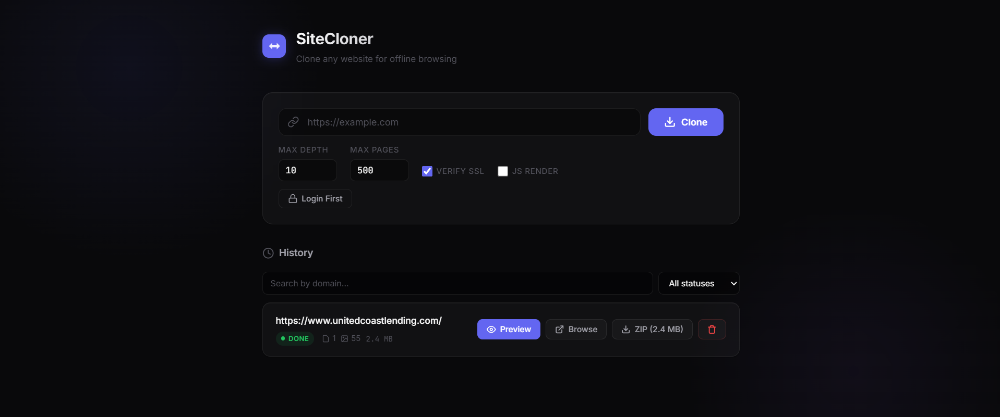

# SiteCloner

A Python-based static website cloner with a real-time web UI. Provide a URL, and SiteCloner will crawl the entire site — static, JavaScript-rendered, or behind authentication — download all pages and assets, rewrite URLs for offline use, and package everything for local browsing, in-app preview, or ZIP download.



## Features

- **Full site cloning** — crawls HTML pages, CSS, JavaScript, images, fonts, and videos
- **Offline-ready** — all internal URLs are rewritten to relative paths so the cloned site works without a server
- **SPA / JavaScript rendering** — optional Playwright integration renders JS-heavy pages (React, Vue, Angular) via a ThreadedPlaywrightRenderer that runs in a separate thread with cookie support
- **Real-time progress** — live updates via Server-Sent Events (SSE) with page count, asset count, error count, and activity log
- **In-app site preview** — preview cloned sites in a sandboxed iframe modal without leaving the UI
- **Dedicated browse URL** — browse cloned sites at `/site/{job_id}/` in a new tab with SPA routing support
- **ZIP download** — download the entire cloned site as a ZIP with file size displayed on the button
- **Job cancellation** — cancel in-progress jobs at 3 checkpoints (crawl, download, rewrite)
- **Retry logic** — exponential backoff with jitter for transient failures (configurable, default 3 attempts)
- **Categorized error reporting** — errors classified as TIMEOUT, DNS_FAILURE, HTTP_ERROR, SSL_ERROR, TOO_LARGE, PARSE_ERROR, or UNKNOWN with a clickable detail panel
- **robots.txt compliance** — respects robots.txt rules and crawl-delay by default (configurable)
- **Sitemap discovery** — optional sitemap.xml parsing for URL discovery
- **Rate limiting** — per-domain request delay to avoid overwhelming target servers
- **API rate limiting** — sliding window rate limiter per IP on the clone endpoint (default 10 req/min)
- **SSL verification toggle** — disable SSL verification for self-signed or internal certificates
- **Browser-based login** — "Login First" opens a real browser so you can log into the target site; cookies and navigation links are captured automatically for authenticated cloning
- **Authentication support** — pass custom cookies and HTTP headers for authenticated sites
- **Compression support** — handles gzip, deflate, and Brotli-compressed responses
- **Priority download queue** — CSS files downloaded first to discover secondary assets (fonts, backgrounds)
- **Async file I/O** — concurrent file writes via aiofiles with semaphore (20 simultaneous writes)
- **Charset detection** — detects encoding from Content-Type header, HTML meta tags, and XML declarations
- **Job cleanup** — automatic TTL-based cleanup of expired jobs (default 1 hour)
- **Duplicate detection** — warns when cloning a URL that was already cloned recently
- **Job history** — search by domain and filter by status (Done, Failed, Cancelled, Crawling, Downloading)
- **Retry failed jobs** — one-click retry for failed or cancelled jobs
- **Configurable** — control crawl depth, max pages, concurrency, timeout, file size limits, and more
- **Seed URL injection** — navigation links discovered during browser login are automatically added to the crawl queue

## How It Works

SiteCloner operates in four sequential phases:

### Phase 1: Crawl (BFS)

The engine starts from the given URL and performs a **breadth-first search** across the site. For each HTML page it downloads:

1. The page content is fetched via aiohttp (or ThreadedPlaywrightRenderer if JS rendering is enabled or auth cookies are present)
2. BeautifulSoup parses the HTML to extract two things:
   - **Page links** (`<a href>`) — queued for further crawling (if within depth limit)
   - **Asset URLs** (CSS, JS, images, fonts, videos from `<link>`, `<script>`, ``, `<video>`, `<audio>`, `<source>`, inline styles, etc.)
3. Only same-domain links are followed; external URLs are left as-is
4. robots.txt rules are checked before crawling each URL (if enabled)

5. Seed URLs from a browser login session are injected into the initial crawl queue

Crawling stops when `max_depth`, `max_pages` is reached, or cancellation is requested.

### Phase 2: Download Assets

Assets are downloaded in **two priority waves**:

1. **CSS files first** — downloaded concurrently, then parsed for secondary references (`url()` values pointing to fonts, background images)
2. **All other assets + secondary CSS assets** — downloaded concurrently in the second wave

An asyncio semaphore limits parallelism (default: 10 concurrent requests). Failed downloads are retried with exponential backoff and jitter.

### Phase 3: Rewrite URLs

Once all files are downloaded and a complete `url_map` (absolute URL → local file path) is built, the engine rewrites every internal URL:

- **HTML files**: rewrites `href`, `src`, `srcset`, `poster`, inline `style` attributes, `<style>` blocks, and `<meta>` image tags. Removes `<base>` tags since all paths become relative.
- **CSS files**: rewrites all `url()` references (backgrounds, fonts, imports)

External URLs (different domain) are left as absolute URLs.

### Phase 4: Save to Disk

All rewritten files are written asynchronously (via aiofiles) to `output/<domain>_<timestamp>/`, preserving the original site's directory structure. Total site size is computed and stored on the job.

## Architecture

```
                    +-----------+
  User Browser ---->|  FastAPI   |----> SSE (real-time progress)
                    |  Web UI    |
                    +-----+-----+
                          |
                    +-----v------+
                    | Middleware  |  API rate limiting (per IP)
                    +-----+------+
                          |
               +----------+----------+
               |                     |
        +------v-------+     +------v--------+
        |  JobManager  |     | LoginManager  |
        | lifecycle,   |     | browser login,|
        | SSE, cleanup |     | cookie capture|
        +------+-------+     +---------------+
               |
        +------v-------+
        | CloneEngine  |  BFS orchestrator (4 phases)
        +------+-------+
               |
    +------+---+----+--------+
    |      |        |        |
Downloader Parser Rewriter Renderer
(aiohttp) (BS4)  (BS4)    (ThreadedPlaywright)
    |
+---+--------+
|            |
RateLimiter RobotsChecker
```

## Quick Start

### Prerequisites

- Python 3.10 or higher
- (Optional) Playwright for JS rendering: `pip install playwright && playwright install chromium`

### Installation

```bash
# Clone the repository
git clone <repo-url>
cd copy_site

# Install dependencies
pip install -r requirements.txt

# (Optional) Install Playwright for SPA rendering
pip install playwright
playwright install chromium
```

### Run

```bash
python app.py
```

The server starts at **http://localhost:8000**. Open it in your browser, enter a URL, and hit Clone.

## UI Features

### Clone Form
- URL input with validation
- Max depth and max pages controls
- **Verify SSL** checkbox with tooltip — disable for self-signed/expired certificates
- **JS Render** checkbox with tooltip — enable for single-page apps (React, Vue, Angular)
- **Login First** button — opens a real browser for logging into the target site before cloning
- Login status display showing browser state, captured cookies, and discovered navigation URLs

### Progress Section
- Real-time stats grid: Pages, Assets, Errors (clickable for detail panel)
- Animated progress bar with percentage
- Cancel button for in-progress jobs
- Activity log with timestamped entries
- Categorized error detail panel

### Job History
- Search by domain text input
- Filter by status dropdown (Done, Failed, Cancelled, Crawling, Downloading)
- Job cards with: URL, status badge, page/asset/error counts, site size
- Action buttons: Preview, Browse, ZIP (with size), Retry, Delete

### In-App Preview
- Modal overlay with sandboxed iframe
- Frame-busting protection (neutralizes `top`/`parent` navigation)
- Open in Tab and Close buttons
- Escape key or overlay click to close

## API Reference

### Start a Clone

```
POST /api/clone
```

**Request body:**
```json
{
  "url": "https://example.com",
  "max_depth": 10,
  "max_pages": 500,
  "verify_ssl": true,
  "request_delay": 0.0,
  "respect_robots": true,
  "use_sitemap": false,
  "user_agent": "StaticSiteCloner/1.0",
  "auth_cookies": {"session": "abc123"},
  "auth_headers": {"Authorization": "Bearer token"},
  "use_playwright": false,
  "seed_urls": ["https://example.com/dashboard"]
}
```

| Field | Type | Default | Description |
|-------|------|---------|-------------|
| `url` | string | *required* | The URL to clone |
| `max_depth` | int | 10 | Maximum BFS crawl depth |
| `max_pages` | int | 500 | Maximum HTML pages to crawl |
| `verify_ssl` | bool | true | Validate SSL certificates |
| `request_delay` | float | 0.0 | Delay between requests in seconds |
| `respect_robots` | bool | true | Obey robots.txt rules |
| `use_sitemap` | bool | false | Parse sitemap.xml for URL discovery |
| `user_agent` | string | `StaticSiteCloner/1.0` | HTTP User-Agent header |
| `auth_cookies` | object | null | Custom cookies for authenticated sites |
| `auth_headers` | object | null | Custom HTTP headers |
| `use_playwright` | bool | false | Render pages with headless browser |
| `seed_urls` | array | null | Additional URLs to inject into the crawl queue (e.g. from login discovery) |

**Response:**
```json
{
  "job_id": "abc123",
  "message": "Clone started",
  "warning": ""
}
```

The `warning` field is populated when the URL was already cloned recently.

### List All Jobs

```
GET /api/jobs
```

Returns an array of all clone jobs with their current status.

### Get Job Status

```
GET /api/jobs/{job_id}
```

**Response:**
```json
{
  "job_id": "abc123",
  "url": "https://example.com",
  "domain": "example.com",
  "status": "done",
  "pages_crawled": 42,
  "assets_downloaded": 156,
  "errors_count": 3,
  "error_message": "",
  "errors": [
    {
      "url": "https://example.com/missing.png",
      "category": "http_error",
      "message": "HTTP 404",
      "status_code": 404
    }
  ],
  "site_size_bytes": 4523890,
  "created_at": 1715788800.0,
  "completed_at": 1715788860.0
}
```

**Job statuses:** `pending` → `crawling` → `downloading` → `rewriting` → `done` | `failed` | `cancelled`

**Error categories:** `timeout`, `dns_failure`, `http_error`, `ssl_error`, `too_large`, `parse_error`, `unknown`

### Cancel a Job

```
POST /api/jobs/{job_id}/cancel
```

Requests cancellation of an in-progress job. The job will stop at the next checkpoint (BFS loop, asset download, or rewrite phase).

### Delete a Job

```
DELETE /api/jobs/{job_id}
```

Deletes the job and its output files.

### Stream Progress Events (SSE)

```
GET /api/jobs/{job_id}/events
```

Returns a Server-Sent Events stream. Event types:

| Event Type | Description |
|------------|-------------|
| `status` | Job status changed (crawling, downloading, rewriting, saving) |
| `page_crawled` | An HTML page was downloaded and parsed |
| `asset_downloaded` | An asset (CSS/JS/image/font) was downloaded |
| `crawl_complete` | BFS crawl phase finished |
| `secondary_assets_found` | Additional assets discovered in CSS files |
| `error` | A non-fatal error occurred (includes category and details) |
| `cancelled` | Job was cancelled by the user |
| `done` | Clone completed successfully |
| `end` | Stream is closing |

### Download as ZIP

```
GET /api/jobs/{job_id}/download
```

Returns the cloned site as a `.zip` file. Only available after the job completes.

### Browse Cloned Site

```
GET /site/{job_id}/{path}
```

Dedicated route for browsing cloned sites in a new tab. Injects `<base>` tag for correct asset resolution and `history.replaceState` for SPA routing compatibility.

```
GET /api/jobs/{job_id}/browse/{path}?embed=1
```

API browse endpoint used by the iframe preview. With `embed=1`, adds frame-busting protection and appropriate CSP headers.

### Browser Login Flow

```
POST /api/auth/login
```

**Request body:**
```json
{
  "url": "https://example.com/login"
}
```

Starts a browser login session. Opens a real Chromium browser where the user can manually log in to the target site. Returns a `session_id` to track the session.

```
GET /api/auth/login/{session_id}
```

Polls the login session status. Returns status (`pending`, `browser_open`, `done`, `expired`, `failed`), captured cookies, and discovered navigation URLs (seed URLs).

```
POST /api/auth/login/{session_id}/done
```

Signals that the user has finished logging in. The system captures cookies and navigation links from the authenticated page, then closes the browser.

## Configuration

Default settings are defined in `config.py`:

| Parameter | Default | Description |
|-----------|---------|-------------|
| `max_depth` | 10 | Maximum crawl depth from the start URL |
| `max_pages` | 500 | Maximum HTML pages to crawl |
| `concurrency` | 10 | Simultaneous download connections |
| `timeout` | 30s | HTTP request timeout per URL |
| `max_file_size` | 50 MB | Skip files larger than this |
| `user_agent` | `StaticSiteCloner/1.0` | HTTP User-Agent header |
| `output_dir` | `output` | Directory for cloned sites |
| `max_retries` | 3 | Retry attempts for failed downloads |
| `retry_base_delay` | 1.0s | Base delay for exponential backoff |
| `verify_ssl` | true | Validate SSL certificates |
| `request_delay` | 0.0s | Per-domain request delay |
| `respect_robots` | true | Obey robots.txt rules |
| `use_sitemap` | false | Parse sitemap.xml for URLs |
| `job_ttl` | 3600s | Job expiration time (auto-cleanup) |
| `api_rate_limit` | 10 | Max clone requests per IP per window |
| `api_rate_window` | 60s | Rate limit sliding window |
| `use_playwright` | false | Render pages with headless browser |

## Project Structure

```
copy_site/
├── app.py                  # Entry point (FastAPI + uvicorn, lifespan)
├── config.py               # CloneConfig dataclass (all settings)
├── requirements.txt
├── PRD.md                  # Product Requirements Document
├── cloner/                 # Core cloning engine
│   ├── models.py           # CloneJob, Asset, ErrorDetail, ErrorCategory, JobStatus
│   ├── url_utils.py        # URL normalization, path mapping, domain checks
│   ├── downloader.py       # Async HTTP client, retry, rate limiting, compression
│   ├── parser.py           # HTML/CSS link & asset extraction
│   ├── rewriter.py         # URL rewriting for offline use
│   ├── engine.py           # BFS crawl orchestrator (4-phase pipeline)
│   ├── encoding.py         # Charset detection utilities
│   ├── robots.py           # robots.txt parsing & sitemap.xml discovery
│   └── renderer.py         # Playwright renderer (ThreadedPlaywrightRenderer)
├── web/                    # Web layer
│   ├── schemas.py          # Pydantic request/response models
│   ├── job_manager.py      # Job lifecycle, SSE pub/sub, TTL cleanup
│   ├── login_manager.py    # Browser-based login flow (Playwright)
│   ├── routes.py           # API endpoints + cloned site serving
│   └── middleware.py       # API rate limiting middleware
├── static/                 # Web UI (vanilla HTML/CSS/JS)
│   ├── index.html
│   ├── style.css
│   └── app.js
├── tests/                  # Unit tests (98 tests)
│   ├── test_url_utils.py
│   ├── test_parser.py
│   ├── test_rewriter.py
│   ├── test_downloader.py
│   ├── test_engine.py
│   ├── test_routes.py
│   ├── test_job_manager.py
│   └── test_encoding.py
└── output/                 # Cloned sites stored here (gitignored)
```

## Tech Stack

| Component | Technology |
|-----------|-----------|
| Backend | Python 3.10+, FastAPI, uvicorn |
| HTTP Client | aiohttp (async) |
| HTML Parsing | BeautifulSoup4 + lxml |
| CSS Parsing | cssutils + regex |
| File I/O | aiofiles (async) |
| Compression | Brotli |
| SPA Rendering | Playwright (optional) |
| Progress Stream | Server-Sent Events (SSE) |
| Frontend | Vanilla HTML/CSS/JS |
| Testing | pytest + pytest-asyncio |

## Running Tests

```bash
pip install pytest pytest-asyncio aioresponses
pytest tests/ -v
```

## Limitations

- Authentication requires manual login via the browser flow — fully automated login is not supported
- Stays within the same domain — cross-domain pages are not followed
- Large sites may take significant time depending on page count and asset volume
- Some dynamically loaded resources (lazy-loaded images, AJAX content) may be missed unless JS rendering is enabled
- Dynamic server-side functionality (forms, APIs) is not cloned

## License

This project is for educational and personal use. Always respect website terms of service and `robots.txt` when cloning sites.
